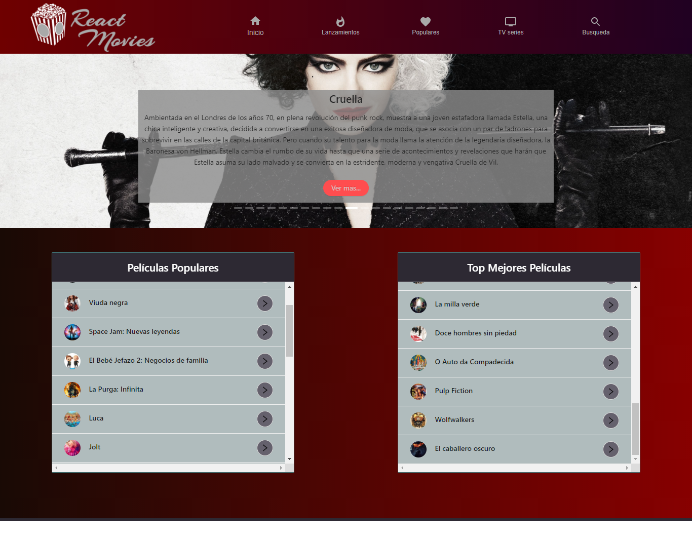

# 🎞🕶***Movie App by Raquel y Silvina***🎥🎬

## Desarrollamos una aplicación en [React](https://es.reactjs.org/) que permite  realizar distintas búsquedas de películas y series.
La información de las mismas se consigue utilizando la API Rest de [The Movie Database](https://www.themoviedb.org/).
 

## Haciendo click [aquí](https://reymga.github.io/home) podrás comenzar a disfrutarlo!!🍿🕶

###👩‍💻👩‍💻***Para elaborar este Proyecto utilizamos las siguientes dependencias:***

👉📁 [React Router](https://reactrouter.com/)

👉📁 [TMDB](https://www.themoviedb.org/)

👉📁 [Material UI](https://material-ui.com/)

👉📁 [Ant Design](https://ant.design/)

👉📁 [Axios](https://axios-http.com/docs/intro)

👉📁 [React-player](https://github.com/CookPete/react-player)

## 👨‍💻 Si querés tener el código en tu computadora, deberás seguir estos pasos en tu terminal:

### ✔️Ir al repositorio
### ✔️Darle click al botón de forkear
### ✔️Darle click al botón de code
### ✔️Abrir tu terminal y poner el comando de git clone <url>
### ✔️Entrar a la carpeta del proyecto y abrirlo en tu IDE 

## Y listo! Podrás disfrutar de este proyecto 🤗

